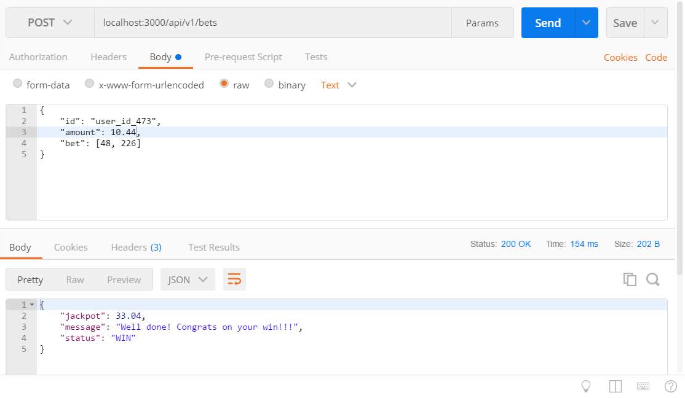
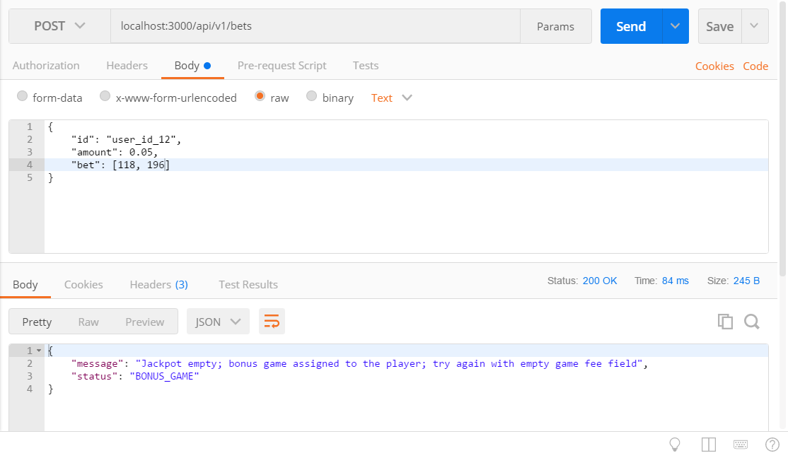
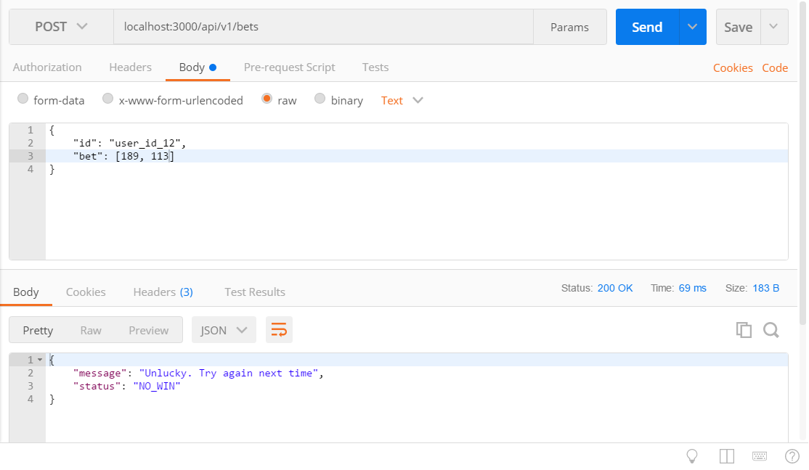
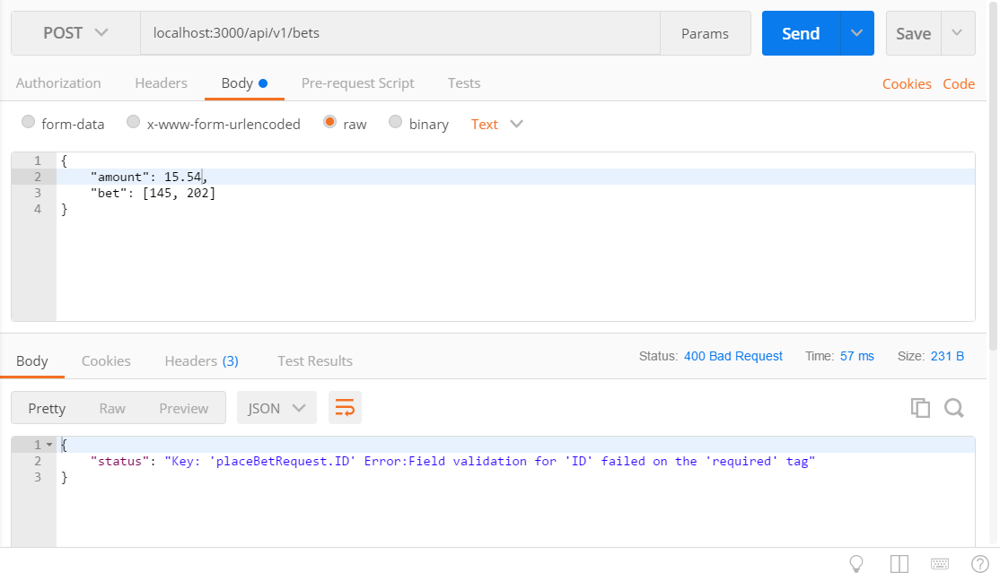
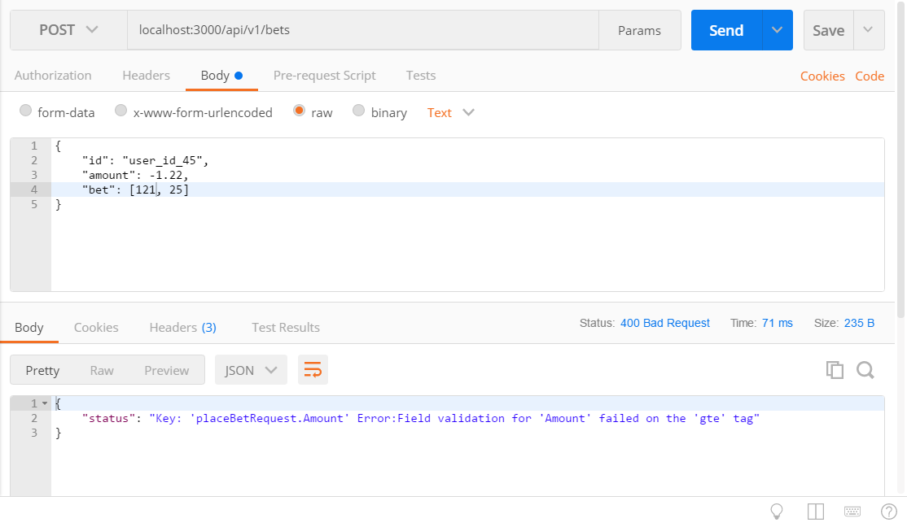

# A simple lottery game example

The idea of the game is that a client is sending to the server its unique id, game participation fee, and 2 random bytes. The server responds with no_win, win amount or bonus one free game.

Server logic is the following:
1. The server has a common jackpot for all players and each game fee is accumulated into it. After a player wins the jackpot gets empty.
2. The server has a stack of winning bytes pairs (lucky pairs stack). stack has a size limit and can hold only up to 100 pairs.
3. When a player connects, the server pops the first pair from lucky pairs stack and if two bytes match with what the player has provided then the player receives all jackpot amount.
4. The server has to fill lucky pairs stack constantly but not exceed its size limit.
5. Only one player can win the current jackpot at the specific point of time (even if the server got several same winning pairs from different players).
6. If a player wins, but at that point, jackpot amount is zero then the player receives bonus free game. So a player may retry and play one game without a fee.
7. If there are no game rounds during 10 seconds then the server pops and discards one pair from lucky pairs stack, to be sure that pairs are updated constantly.

# Requirements

Golang installed

# Installation

Add project working directory and the ./vendor folder to your GOPATH:
```
$ export GOPATH=/home/me/projects/lottery-game/vendor:/home/me/projects/lottery-game:$GOPATH
````

# Running the server

Navigate to the project home directory and type
```
$ go run src\go-server\main.go src\go-server\init.go
```

The server will start listening on port 3000.
To connect, send HTTP POST requests to `http://localhost:3000/api/v1/bets` endpoint.

# Client API

Client request JSON format is this:
```
{
	"id": "crazy_gambler367",
	"amount": 110.3,
	"bet": [145, 91]
}
```

The "bet" field contains an array of length two with integer values between 0 to 255 treated as uint8 (byte) datatype values. A two-byte long entry is reconstructed from the two as a uint16 (little endian) value.

# Usage examples

A winning combination (jackpot):



Not a winning combination:


A winning combination with the jackpot just taken by another player (free bonus game awarded):



Bonus game without game fee:


Attempt to play an illegitimate free game (same player id is used for the second time):


Some basic input validation has been implemented:

Required fields missing:



Negative game fee:



Byte value out of [0,255] bounds:


